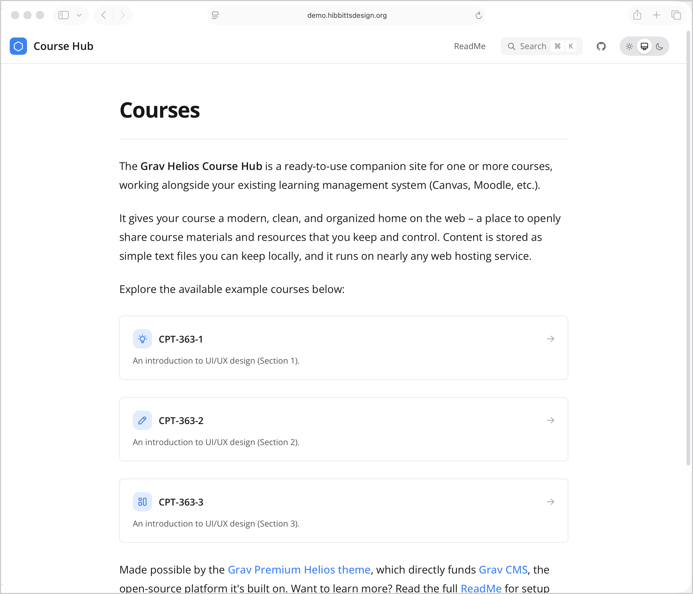
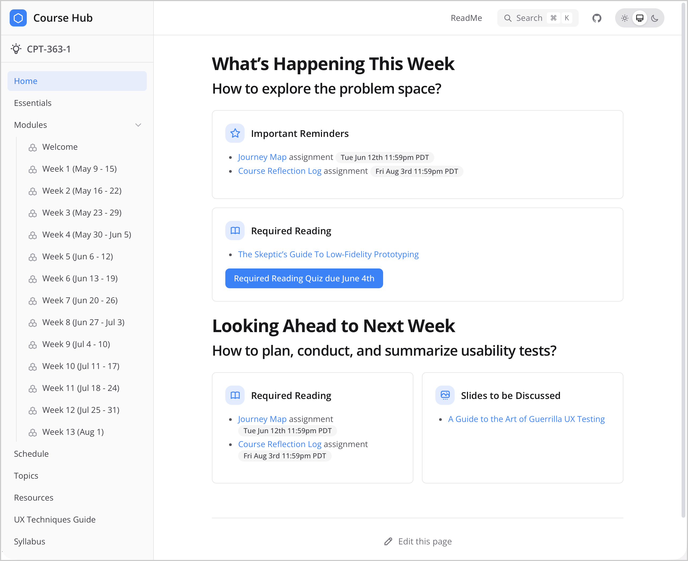

# Helios Course Hub Plugin

Requires the [Grav Premium Helios theme](https://getgrav.org/premium/helios). Designed for use with the [Grav Helios Course Hub](https://github.com/hibbitts-design/grav-skeleton-helios-course-hub) skeleton, providing custom CSS, JavaScript, shortcodes and enhanced Admin Panel readability.

Figure 1. Example Grav Helios Course Hub website, with a single course.

Figure 2. Example Grav Helios Course Hub website, with multiple courses.

## Features

- Course List page template with auto-generated course cards
- Built-in shortcodes for embedding content (Google Slides, PDFs, H5P, Embedly)
- Embedly card support with automatic dark/light theme detection
- Enhanced Admin Panel readability (increased font sizes, Editor Pro toolbar scaling)
- Automatic theme detection with fallback to Quark if Helios is not installed
- Overrides the Helios "Version" label to "Course" for multi-course setups

## Shortcodes

- `[googleslides url="..."]` — Responsive Google Slides embed
- `[pdf url="..."]` — PDF viewer via Google Docs
- `[h5p url="..."]` or `[h5p id="..."]` — H5P interactive content
- `[embedly url="..."]` — Embedly card with dark mode support

## Course List Page

The `courselist` page template automatically generates course cards from detected version folders. Each card displays a title, icon and description sourced from the course root folder's markdown file (e.g. `cpt-363/default.md`).

## Requirements

- Grav CMS >= 1.7.0
- Grav Premium Helios Theme
- Shortcode Core plugin >= 5.0.0

## License

MIT — Hibbitts Design
